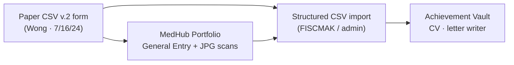

# MedHub Portfolio Entry ↔ Clinical Skills (CSV v.2) — Linked Example

**Your screenshot:** Portfolio → General Entry → **"CSV 1 by Dr. Wang"**  
**Attachments:** `IMG_5489.jpg`, `IMG_5490.jpg` (uploaded 7/22/24)  
**Paper form:** Psychiatry Clinical Skills Evaluation **CSV v.2** (examiner Alex Wong, 7/16/24)

---

## How these pieces fit together



| Artifact | Role |
|----------|------|
| **Paper CSV v.2** | Source of truth for 1–8 item ratings + examiner comments |
| **Portfolio "CSV 1 by Dr. Wang"** | Program record + **scanned images** (IMG_5489/5490) |
| **FISCMAK structured CSV** | Machine-readable ratings + narrative for pre-CCC & career vault |

**Note:** Portfolio title says **Dr. Wang**; paper header says **Alex Wong**. Link via `eval_id` in import; flag for coordinator if names/dates don’t match.

---

## Your portfolio entry (from screenshot)

| Field | Value |
|-------|--------|
| **Entry type** | General Entry |
| **Title** | CSV 1 by Dr. Wang |
| **Entry notes** | *(empty in screenshot — recommend pasting summary or FISCMAK debrief)* |
| **Files** | IMG_5489.jpg (84K), IMG_5490.jpg (64K) |
| **Uploaded** | 7/22/24 by Palmer |
| **Competencies checked** | Patient Care, Medical Knowledge, ICS, Professionalism, SBP |
| **Not checked** | Practice-based Learning & Improvement |
| **Visibility** | PD + faculty mentors can view ✓ |

**Why PBLI unchecked:** Form is skills/observation ratings, not QI/EBM project — reasonable. FISCMAK can still tag **Growth Engine** if narrative mentions learning.

---

## Example CSV — portfolio only

**Wide (one row):** `examples/uh_medhub_portfolio_entry_wide.csv`

```csv
portfolio_entry_id,eval_id,entry_type,entry_title,attachment_files,competencies_checked,linked_eval_date
uh-portfolio-2024-csv1,uh-csv-2024-0716-001,General Entry,"CSV 1 by Dr. Wang","IMG_5489.jpg;IMG_5490.jpg","Patient Care;Medical Knowledge;Interpersonal & Comm. Skills;Professionalism;Systems-based Practice",2024-07-16
```

**Long (one row per attachment):** `examples/uh_medhub_portfolio_entry_long.csv`

---

## Example CSV — full bundle (eval + portfolio + ratings)

Import order:

1. `uh_clinical_skills_eval_long.csv` — 15 rating rows + comments  
2. `uh_medhub_portfolio_entry_wide.csv` — links scans to same `eval_id`  
3. Optional: OCR pipeline reads JPGs → validates against structured rows  

**Shared key:** `eval_id = uh-csv-2024-0716-001`

---

## What FISCMAK should do with this pattern

### Rail A (program)
- Store portfolio metadata + attachment URLs (if MedHub export provides them)  
- Attach structured ratings to pre-CCC “Clinical skills / observed interview” section  
- Flag: **paper-native** eval (not MedHub milestone grid)

### Rail B (resident career)
From Wong comments + scores 6–7:

| Evidence | FISCMAK output |
|----------|----------------|
| Rapport, teach-back, empathy (7s on PPR) | CV bullet · **Relational Leadership** |
| Novel depression symptom assessment | Interview story |
| Cultural/gender histories (6s) | ILP growth: diversify history-taking |
| Portfolio scans | Tier 1 attachment; don’t re-OCR for PD surveillance unless validated |

**Suggested Entry Notes** (paste into MedHub or FISCMAK vault):

> PGY-3 observed interview (medium difficulty, 60 min). Examiner noted strong opening with patient treatment goals, teach-back, empathic style, and creative depression symptom inquiry. Scores 6–7 across sections; growth area: structured cultural and gender/sexual histories. Scans attached.

---

## Competency checkbox → FISCMAK domain map

| MedHub competency (checked) | FISCMAK domain |
|----------------------------|----------------|
| Patient Care | Clinical Craft |
| Medical Knowledge | Knowledge Base |
| Interpersonal & Comm. Skills | Relational Leadership |
| Professionalism | Trust & Identity |
| Systems-based Practice | Systems Impact |
| PBLI (unchecked) | Growth Engine — optional tag from comments |

---

## Visibility checkbox — privacy

**"Allow Program Director and Faculty Mentor(s) to view"** = checked  

→ This entry is **program-visible**, not private vault.  
→ Examiner narrative and scores appropriate for **semiannual prep** and letter writer packets.  
→ FISCMAK **Self Reflection**-tier content stays separate in private vault.

---

## Improved workflow (resident)

1. Complete paper **CSV v.2** with examiner  
2. Photograph/upload to MedHub portfolio (**CSV 1 by Dr. Wang**)  
3. FISCMAK: enter or OCR ratings → generates **Entry Notes** + CV bullets  
4. Resident copies summary into MedHub **Entry Notes** (optional)  
5. PD sees structured summary at pre-CCC without re-reading JPGs  

---

## Files in this bundle

| File | Contents |
|------|----------|
| `uh_clinical_skills_eval_long.csv` | Item-level ratings 1–8 |
| `uh_clinical_skills_eval_wide.csv` | One row per eval |
| `uh_medhub_portfolio_entry_wide.csv` | Portfolio entry + link to eval |
| `uh_medhub_portfolio_entry_long.csv` | One row per JPG attachment |

All use `trainee_initials = KP` and `eval_id = uh-csv-2024-0716-001`.
